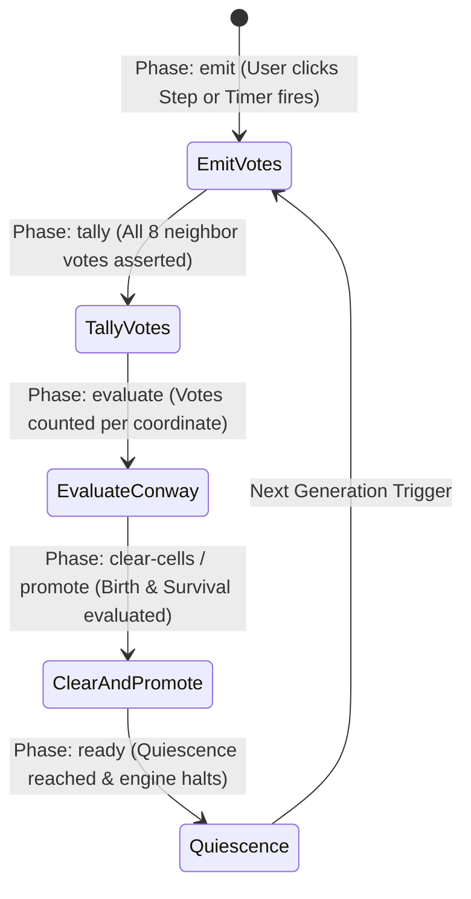

# OPS5 Sample Applications (`go-ops5-apps`)

[](https://pkg.go.dev/github.com/graemenewlands/ops5)
[](LICENSE)

A showcase collection of modern, production-grade applications built on the [**OPS5 pure Go runtime & Rete pattern matching engine**](https://github.com/graemenewlands/ops5).

This repository demonstrates how classic forward-chaining production rules, conflict resolution (LEX/MEA), memory unlinking, and Rete pattern discrimination solve real-world problems and simulations without imperative loops.

---

## Applications Catalog

| Application | Domain | Technologies | Status |
| :--- | :--- | :--- | :--- |
| [**Conway's Game of Life**](#1-conways-game-of-life-webassembly) | Cellular Automata & Simulation | WebAssembly, HTML5 Canvas, OPS5 Rete | **Live** |
| **E-Commerce & Fraud Detection** | Business Rules Engine & CEP | Go 1.23, Custom Actions, Dynamic Rules | *Planned* |
| **IoT Smart Facility Monitoring** | Event Stream Processing | Reactive Joins, Negative Conditions | *Planned* |
| **Diagnostic Expert System** | Goal-Directed AI | Means-Ends Analysis (MEA Strategy) | *Planned* |
| **Distributed Task Cluster** | High-Throughput Concurrency | ParaOPS5 Partitioned Engine | *Planned* |

---

## 1. Conway's Game of Life (WebAssembly)

An interactive, browser-based visualization of John Conway's classic cellular automaton where **every single generation is computed entirely by declarative OPS5 production rules** running inside a compiled WebAssembly binary.



### Key Architectural Highlights

1. **Zero Imperative Loops**: The grid has no nested 2D loops (`for x ... for y`). Working Memory Elements (WMEs) represent live cells and direction vectors; the Rete discrimination network automatically computes neighbor adjacencies.
2. **Toroidal Coordinate Wrapping**: Border wrapping is calculated directly inside OPS5 RHS `(compute ...)` expressions using modulo arithmetic:
   ```ops5
   (bind <nr> (compute <r> + <dr> + <h> % <h>))
   (bind <nc> (compute <c> + <dc> + <w> % <w>))
   ```
3. **Stage-Based Control Lifecycle**:
   - **`emit`**: Live cells match against 8 directional Moore deltas and emit `vote` WMEs.
   - **`tally`**: An accumulator consumption rule groups and counts votes per coordinate.
   - **`evaluate`**: Relational tests trigger `birth` (neighbor count = 3) and `survival` (neighbor count = 2 or 3).
   - **`clear-cells` & `promote`**: Retracts previous generation cells and promotes `next-cell` facts.
   - **`ready`**: The engine naturally pauses in **quiescence** (conflict set is empty) until the browser animation loop requests the next generation.
4. **Pure Go WebAssembly Runtime**:
   - Compiles via standard `GOOS=js GOARCH=wasm`.
   - Bridges to the DOM/Canvas via `syscall/js`.
   - Renders at up to 60 FPS on high-DPI HTML5 canvas.

---

### Quick Start & Running Locally

#### 1. Launch the WebAssembly Application

Using `make`:
```bash
make serve
```

Or using the Go toolchain directly:
```bash
# 1. Compile WebAssembly binary
GOOS=js GOARCH=wasm go build -o apps/life/web/main.wasm ./apps/life/wasm

# 2. Start the local server
go run ./apps/life/server -port 8080
```

Open your browser to: **[http://localhost:8080](http://localhost:8080)**

#### 2. Run the Automated Tests

Verify the Game of Life rule cycle against classic Conway oscillators and spaceships (Blinker, Toad, Glider translation over 4 generations):
```bash
make test
```

---

### Interactive Web Controls

- **Play / Pause**: Start or pause continuous simulation at the chosen frame rate (`Spacebar`).
- **Step**: Trigger a single Match-Resolve-Act cycle across all 5 stages (`S` key).
- **Clear**: Retract all live cells and reset generation counter (`C` key).
- **Interactive Painting**: Click or click-and-drag directly on the canvas grid to paint or erase cells.
- **Preset Library**: One-click insertion of:
  - *Oscillators*: Blinker (period 2), Toad (period 2), Beacon (period 2), Pulsar (period 3)
  - *Spaceships*: Glider, Lightweight Spaceship (LWSS)
  - *Methuselahs & Guns*: Gosper Glider Gun, Acorn (5,206 generations of active life), R-Pentomino
  - *Generators*: Random Soup (15% density)
- **Live Metrics Dashboard**: Real-time display of Generation count, Live Population, OPS5 Rule Cycles fired, Step Latency (ms), and active Working Memory Elements (WMEs).
- **Embedded Rule Inspector**: Live drawer displaying the exact [`life.ops`](apps/life/rules/life.ops) source code driving the engine.

---

### Repository Structure

```
go-ops5-apps/
├── README.md                  # Showcase documentation and usage guide
├── Makefile                   # Automation for building Wasm, running tests, and serving
├── go.mod                     # Go module definitions
├── go.sum                     # Go module checksums
├── .gitignore                 # Standard Go ignore patterns
└── apps/
    └── life/
        ├── rules/
        │   └── life.ops       # Declarative OPS5 rule definitions for Conway's Game of Life
        ├── engine.go          # Go LifeEngine wrapper managing OPS5 working memory and grid
        ├── life_test.go       # Automated tests verifying Conway patterns
        ├── wasm/
        │   └── main.go        # Go WebAssembly entrypoint with syscall/js bridge
        ├── server/
        │   └── main.go        # Static HTTP server with application/wasm MIME mapping
        └── web/
            ├── index.html     # HTML5 canvas frontend with stats and control panel
            ├── style.css      # Dark-mode responsive styling
            ├── app.js         # Canvas rendering, mouse painting, and animation loop
            ├── wasm_exec.js   # Official Go 1.23 WebAssembly runtime glue
            └── main.wasm      # Compiled WebAssembly binary
```

---

## License

This project is licensed under the Apache License, Version 2.0. See [LICENSE](LICENSE) for details.
