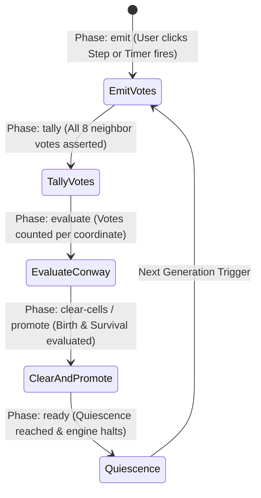
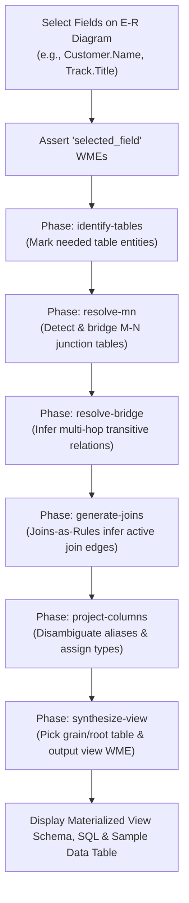
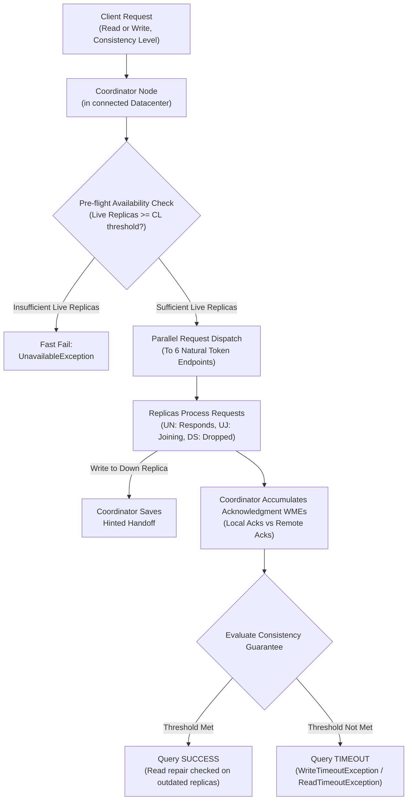

# OPS5 Sample Applications (`go-ops5-apps`)

[](https://pkg.go.dev/github.com/graemenewlands/ops5)
[](LICENSE)

A showcase collection of modern, production-grade applications built on the [**OPS5 pure Go runtime & Rete pattern matching engine**](https://github.com/graemenewlands/ops5).

This repository demonstrates how classic forward-chaining production rules, conflict resolution (LEX/MEA), memory unlinking, and Rete pattern discrimination solve real-world problems and simulations without imperative loops.

---

## Applications Catalog

| Application | Domain | Technologies | Status |
| :--- | :--- | :--- | :--- |
| [**Cassandra Protocol Dual-Ring Simulator**](#3-cassandra-protocol-dual-ring-simulator-webassembly) | Distributed Systems & Consensus | WebAssembly, Dual-Ring SVG, OPS5 Rete | **Live** |
| [**Conway's Game of Life**](#1-conways-game-of-life-webassembly) | Cellular Automata & Simulation | WebAssembly, HTML5 Canvas, OPS5 Rete | **Live** |
| [**Schema & Materialized View Synthesizer**](#2-schema--materialized-view-synthesizer-webassembly) | Database Modeling & View Synthesis | WebAssembly, Interactive E-R Diagram, OPS5 Rules | **Live** |
| **E-Commerce & Fraud Detection** | Business Rules Engine & CEP | Go 1.23, Custom Actions, Dynamic Rules | *Planned* |
| **IoT Smart Facility Monitoring** | Event Stream Processing | Reactive Joins, Negative Conditions | *Planned* |
| **Diagnostic Expert System** | Goal-Directed AI | Means-Ends Analysis (MEA Strategy) | *Planned* |
| **Distributed Task Cluster** | High-Throughput Concurrency | ParaOPS5 Partitioned Engine | *Planned* |

---

## 1. Conway's Game of Life (WebAssembly)

An interactive, browser-based visualization of John Conway's classic cellular automaton where **every single generation is computed entirely by declarative OPS5 production rules** running inside a compiled WebAssembly binary.



### Key Architectural Highlights

1. **Zero Imperative Loops**: The grid has no nested 2D loops (`for x ... for y`). Working Memory Elements (WMEs) represent live cells and direction vectors; the Rete discrimination network automatically computes neighbor adjacencies.
2. **Toroidal Coordinate Wrapping**: Border wrapping is calculated directly inside OPS5 RHS `(compute ...)` expressions using modulo arithmetic:
   ```ops5
   (bind <nr> (compute <r> + <dr> + <h> % <h>))
   (bind <nc> (compute <c> + <dc> + <w> % <w>))
   ```
3. **Stage-Based Control Lifecycle**:
   - **`emit`**: Live cells match against 8 directional Moore deltas and emit `vote` WMEs.
   - **`tally`**: An accumulator consumption rule groups and counts votes per coordinate.
   - **`evaluate`**: Relational tests trigger `birth` (neighbor count = 3) and `survival` (neighbor count = 2 or 3).
   - **`clear-cells` & `promote`**: Retracts previous generation cells and promotes `next-cell` facts.
   - **`ready`**: The engine naturally pauses in **quiescence** (conflict set is empty) until the browser animation loop requests the next generation.
4. **Pure Go WebAssembly Runtime**:
   - Compiles via standard `GOOS=js GOARCH=wasm`.
   - Bridges to the DOM/Canvas via `syscall/js`.
   - Renders at up to 60 FPS on high-DPI HTML5 canvas.

---

### Quick Start & Running Locally

#### 1. Launch the WebAssembly Application

Using `make`:
```bash
make serve
```

Or using the Go toolchain directly:
```bash
# 1. Compile WebAssembly binary
GOOS=js GOARCH=wasm go build -o apps/life/web/main.wasm ./apps/life/wasm

# 2. Start the local server
go run ./apps/life/server -port 8080
```

Open your browser to: **[http://localhost:8080](http://localhost:8080)**

#### 2. Run the Automated Tests

Verify the Game of Life rule cycle against classic Conway oscillators and spaceships (Blinker, Toad, Glider translation over 4 generations):
```bash
make test
```

---

### Interactive Web Controls

- **Play / Pause**: Start or pause continuous simulation at the chosen frame rate (`Spacebar`).
- **Step**: Trigger a single Match-Resolve-Act cycle across all 5 stages (`S` key).
- **Clear**: Retract all live cells and reset generation counter (`C` key).
- **Interactive Painting**: Click or click-and-drag directly on the canvas grid to paint or erase cells.
- **Preset Library**: One-click insertion of:
  - *Oscillators*: Blinker (period 2), Toad (period 2), Beacon (period 2), Pulsar (period 3)
  - *Spaceships*: Glider, Lightweight Spaceship (LWSS)
  - *Methuselahs & Guns*: Gosper Glider Gun, Acorn (5,206 generations of active life), R-Pentomino
  - *Generators*: Random Soup (15% density)
- **Live Metrics Dashboard**: Real-time display of Generation count, Live Population, OPS5 Rule Cycles fired, Step Latency (ms), and active Working Memory Elements (WMEs).
- **Embedded Rule Inspector**: Live drawer displaying the exact [`life.ops`](apps/life/rules/life.ops) source code driving the engine.

---

## 2. Schema & Materialized View Synthesizer (WebAssembly)

An interactive, browser-based relational schema graph modeler and materialized view generator. **Tables, columns, 1-N foreign keys, and M-N relationships are represented directly as Working Memory Elements (WMEs)** in the OPS5 engine, and **joins are modeled as forward-chaining production rules**.

When you select target fields on the interactive Entity-Relationship (E-R) diagram and click **"Done: Synthesize Materialized View"**, the OPS5 Rete network automatically discovers join paths, bridges multi-hop entities, resolves Many-to-Many junction tables, projects denormalized columns with alias conflict resolution, and synthesizes a production SQL materialized view definition with a live sample data preview.



### Key Architectural Highlights

1. **Relational Schema as Facts**:
   - `table`: Name, display title, primary key.
   - `field`: Table, column name, data type, `is_pk`, `is_fk`.
   - `relation`: 1-N / N-1 foreign key relationships between tables.
   - `mn_relationship`: Many-to-Many associations with junction tables (e.g. `PlaylistTrack` between `Playlist` and `Track`, or `OrderDetails` between `Orders` and `Products`).
2. **Joins as Declarative Rules**:
   Instead of writing procedural graph algorithms (Dijkstra, BFS), joins and path discovery are evaluated purely by OPS5 pattern matching:
   - Direct join rules fire when two needed tables share a foreign key relation.
   - M-N rules automatically pull junction tables into working memory.
   - Bridge rules discover intermediate tables needed to connect distant entities.
3. **Automated View Synthesis & Disambiguation**:
   - Analyzes selected fields, identifies root driving table (lowest grain or junction table).
   - Generates disambiguated aliases when identical column names collide (e.g. `artist_name` vs `track_name`).
   - Produces formatted `CREATE MATERIALIZED VIEW ... AS SELECT ... FROM ... JOIN ... ON ...`.
   - Evaluates in-memory joins over realistic sample data to render an instant preview table.
4. **Multi-Schema Support**:
   - **Chinook (Default)**: 11 tables representing artists, albums, tracks, genres, invoices, customers, and playlist M-N associations.
   - **Northwind**: 8 core tables with customers, orders, order details (M-N), products, categories, suppliers, and employees.

---

### Quick Start & Running Locally

#### Launch Schema & Materialized View Synthesizer:
```bash
# Using make (starts dev server on port 8081)
make serve-schema

# Or using the Go toolchain directly
GOOS=js GOARCH=wasm go build -o apps/schema/web/main.wasm ./apps/schema/wasm
go run ./apps/schema/server -port 8081
```
Open your browser to: **[http://localhost:8081](http://localhost:8081)**

#### Run Automated Test Suite:
```bash
make test
```
Verifies pattern oscillations for Game of Life and multi-table join tree resolutions, M-N junction inferences, and schema switching for the Schema View Synthesizer.

---

## 3. Cassandra Protocol Dual-Ring Simulator (WebAssembly)

An interactive, browser-based simulation of Apache Cassandra's distributed ring protocol across two 6-node datacenters with 50% dataset distribution (3 replicas per DC, 6 total replicas).



### Key Architectural Highlights

1. **Dual-Ring Topology**:
   - Two 6-node rings: Datacenter 1 (East) and Datacenter 2 (West), connected via inter-DC trunk.
   - 50% dataset distribution: Nodes 1, 2, and 3 in each DC own the token range for the queried dataset (6 natural replicas total).
2. **Node Lifecycle & Health States**:
   - Evaluates combinations of Health (`U` = Up, `D` = Down) and Membership (`S` = Stopped, `J` = Joining, `N` = Normal).
   - Valid lifecycle progression: `DS` &rarr; `UJ` &rarr; `UN`.
   - `DJ` is strictly rejected as an invalid state enum.
3. **Consistency Level Evaluations**:
   - `ONE`: 1 acknowledgment anywhere in cluster.
   - `TWO`: 2 acknowledgments anywhere in cluster.
   - `THREE`: 3 acknowledgments anywhere in cluster.
   - `LOCAL_QUORUM`: $\lfloor 3/2 \rfloor + 1 = 2$ acknowledgments in the coordinator's local DC.
   - `QUORUM`: $\lfloor 6/2 \rfloor + 1 = 4$ acknowledgments across the entire cluster.
4. **Fault Injection & Protocol Behavior**:
   - Pulling the plug on a node transitions it to `DS`.
   - Pre-flight availability check fast-fails with `UnavailableException` if alive replicas cannot satisfy the requested CL before network dispatch.
   - Writes to offline replicas trigger coordinator **Hinted Handoff** WMEs.
   - Reads evaluate Lamport/write timestamps and flag lagging operational replicas for background **Read Repair**.
5. **Dual-Datacenter Automated Traffic Generator**:
   - Simulates real-world background Cassandra cluster traffic by alternating queries across DC1 (East) and DC2 (West).
   - Randomly issues `READ` and `WRITE` queries across all Consistency Levels (`ONE`, `TWO`, `THREE`, `LOCAL_QUORUM`, `QUORUM`).
   - Query arrival rate is governed by a **normal (Gaussian) distribution** ($\mu = 5.0\text{s}, \sigma = 1.2\text{s}$) generated via the Box-Muller transform.
   - Dynamic visual feedback displays countdown timers, active coordinators, animated packet flights, and terminal audit logs.

#### Launch Local Server:
```bash
make serve-cassandra
```
Open your browser to: **[http://localhost:8082](http://localhost:8082)**

---

### Repository Structure

```
go-ops5-apps/
├── README.md                  # Showcase documentation and usage guide
├── Makefile                   # Automation for building Wasm, running tests, and serving
├── go.mod                     # Go module definitions (github.com/graemenewlands/ops5)
├── go.sum                     # Go module checksums
├── .gitignore                 # Standard Go ignore patterns
└── apps/
    ├── cassandra/             # Cassandra Protocol Dual-Ring Consistency Simulator
    │   ├── rules/cassandra.ops # Declarative protocol rules (dispatch, quorum, hints, repair)
    │   ├── data/              # Cluster and datacenter ring topology model
    │   ├── engine.go          # Go CassandraEngine managing WMEs and queries
    │   ├── cassandra_test.go  # Consistency level and fault injection unit tests
    │   ├── wasm/main.go       # WebAssembly syscall/js entrypoint
    │   ├── server/main.go     # Local HTTP development server (port 8082)
    │   └── web/               # Dual-ring SVG UI, packet animator, and wasm artifacts
    ├── life/                  # Conway's Game of Life in OPS5
    │   ├── rules/life.ops     # 5-stage declarative cellular automaton rules
    │   ├── engine.go          # Go LifeEngine wrapper
    │   ├── life_test.go       # Conway pattern unit tests
    │   ├── wasm/main.go       # WebAssembly syscall/js entrypoint
    │   ├── server/main.go     # Local HTTP development server
    │   └── web/               # HTML5 Canvas interface and wasm artifacts
    └── schema/                # Schema & Materialized View Synthesizer
        ├── rules/schema.ops   # OPS5 join rules and view synthesis pipeline
        ├── data/              # Chinook & Northwind schemas and sample datasets
        ├── engine.go          # Go SchemaEngine managing working memory & joins
        ├── schema_test.go     # Unit tests verifying join inference and SQL synthesis
        ├── wasm/main.go       # WebAssembly syscall/js entrypoint
        ├── server/main.go     # Local HTTP development server
        └── web/               # Interactive E-R Diagram & Materialized View UI
```

---

## License

This project is licensed under the Apache License, Version 2.0. See [LICENSE](LICENSE) for details.
